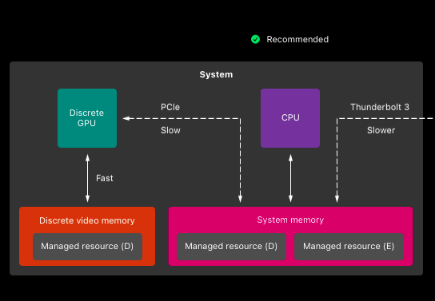

## Cách kết nối bandwidth thường

https://developer.apple.com/documentation/metal/gpu_devices_and_work_submission/multi-gpu_systems/adjusting_for_gpu_memory_bandwidth_tradeoffs

## Smart access memory (resizeable bar)
https://qmtech.vn/tat-tan-tat-ve-amd-smart-access-memory/

CPUs are traditionally limited to a **256 MB** I/O memory address region for the GPU frame buffer. This of it as an “data dump” for stuff like textures, shaders and geometry.
Since this “data dump” is limited to 256 MB, the CPU can only send texture, shader and geometry data as and when the GPU requires them.
This introduces some latency – delay from when the GPU requires the data, and the CPU send them
https://www.techarp.com/computer/guide-smart-access-memory/#:~:text=Smart%20Access%20Memory%20%2F%20Resizable%20BAR,the%20GPU%20at%20all%20times.
Turning on **Resizable BAR** or **Smart Access Memory** greatly expands the size of that data dump, letting the CPU directly access the GPU’s entire frame buffer memory.
Instead of transferring data when requested by the GPU, the CPU processes and stores the data directly in the graphics memory.
Graphics assets can be transferred to graphics memory in full, instead of in pieces. In addition, multiple transfers can occur simultaneously, instead of being queued up.
