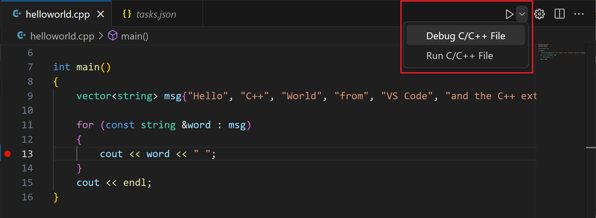
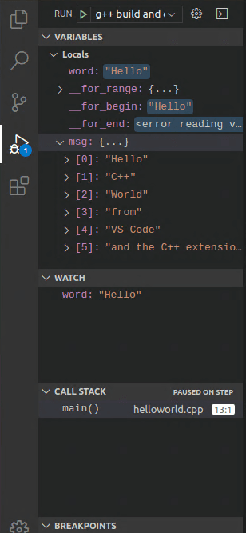
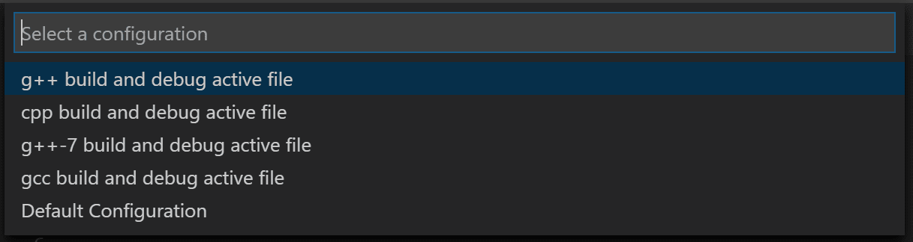

# Source 
[ Microsoft tutorial ](https://code.visualstudio.com/docs/cpp/config-linux)

# Prerequisites
Install gcc compiler, gdb

Fedora
```sh
sudo dnf install make automake gcc gcc-c++ kernel-devel gdb
```

# Debug
1. Set a break point

2. From the drop-down next to the play button, select **Debug C/C++ File**.  

3. Choose **C/C++: g++ build and debug active file** from the list of detected compilers on your system 

4. Step through  the code and debug view 

# Customize debugging with launch.json
[MS tutorial](https://code.visualstudio.com/docs/cpp/config-linux#_customize-debugging-with-launchjson)
[Youtube tutorial](https://www.youtube.com/watch?v=2VokW_Jt0oM) at 8:30

you can change debuger: 
```json
"miDebuggerPath": "/usr/bin/gdb"
```

To add launch.json click the **Gear** button next to the play button
You'll then see a dropdown for various predefined debugging configurations. Choose **g++ build and debug active file**


# Config c_cpp_properties.json

