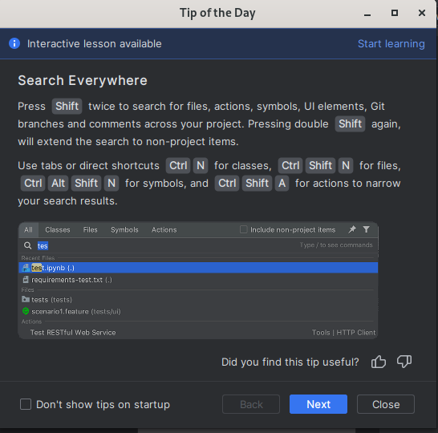

## Pycharm feature

https://www.youtube.com/watch?v=Jt0fNgJr400&t=377s

## Setting virtual enviroment
https://www.jetbrains.com/help/pycharm/creating-virtual-environment.html#python_create_virtual_env

## Abstract Class

in Create a class section
https://www.youtube.com/watch?v=-buaqIbHHxo&t=382s

## Search

`ctrl + f` search `Ctrl + R` thêm field replace

## edit
### Choose, highlight
`Ctrl + W` mỗi lần gõ tổ hợp này vùng bôi đen sẽ rộng ra
